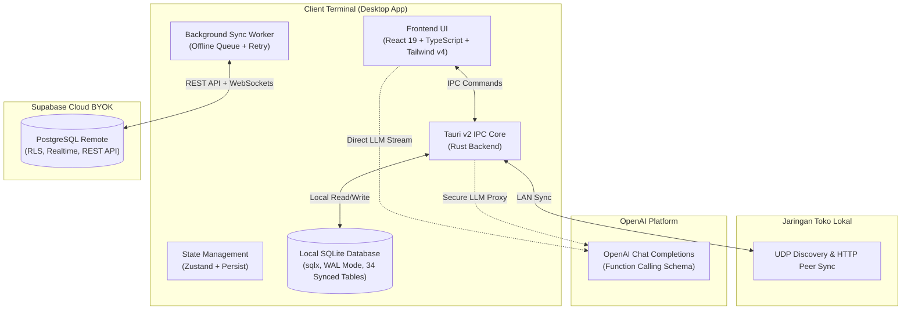

# 🚀 Kivo — Modern Multi-Branch POS & ERP Platform

<div align="center">


**Next-Generation Offline-First Point of Sale & Enterprise Resource Planning**  
*Engineered with Rust, Tauri 2.0, React 19, SQLite, and Supabase Cloud Sync.*

[](https://github.com/AchiraStudio/kivo/releases)
[](https://www.rust-lang.org/)
[](https://tauri.app/)
[](https://react.dev/)
[](https://www.typescriptlang.org/)
[](https://tailwindcss.com/)
[](https://www.sqlite.org/)
[](https://supabase.com/)
[](LICENSE)

[Fitur Utama](#-fitur-utama) •
[Arsitektur Sistem](#-arsitektur-sistem) •
[Instalasi & Menjalankan](#-instalasi--menjalankan) •
[Konfigurasi BYOK](#-arsitektur-keamanan-byok) •
[Hardware & POS](#-dukungan-hardware--printer) •
[Dokumentasi Lengkap](#-panduan-operasional--walkthrough)

</div>

---

## 📖 Tentang Kivo

**Kivo** adalah platform manajemen bisnis, Point of Sale (POS), dan Enterprise Resource Planning (ERP) modern yang dirancang khusus untuk bisnis ritel, apotek, grosir, dan F&B dengan arsitektur **Offline-First**. 

Berbeda dengan sistem POS berbasis web konvensional yang bergantung penuh pada koneksi internet stabil, Kivo memproses seluruh transaksi langsung di atas **database SQLite lokal berkecepatan tinggi**. Ketika koneksi internet tersedia, sistem secara otomatis melakukan sinkronisasi dua arah (*bidirectional sync*) ke **Supabase Cloud** untuk menyatukan data seluruh cabang usaha Anda secara *real-time*.

Kivo dibangun dengan prinsip privasi mutlak: **100% Bring Your Own Key (BYOK)**. Tidak ada API key, database pihak ketiga, ataupun kredensial tersembunyi yang ditanam di dalam aplikasi.

---

## ⚡ Fitur Utama

```
┌────────────────────────────────────────────────────────────────────────┐
│                              EKOSISTEM KIVO                            │
├──────────────┬──────────────┬──────────────┬─────────────┬─────────────┤
│   Kivo POS   │Kivo Inventory│  Purchasing  │ Accounting  │   Kivo AI   │
│  Kasir Kilat │Multi-Satuan  │ Order & HPP  │ Buku Besar  │ Asisten &   │
│ Split Bayar  │Batch & Exp   │ Penerimaan   │ Laba Rugi   │ Analisis    │
│ Cetak Struk  │Stock Opname  │ Hutang (AP)  │ Neraca      │ Cerdas      │
├──────────────┴──────────────┴──────────────┴─────────────┴─────────────┤
│                          Kivo Cloud & LAN                              │
│       Sinkronisasi 34 Tabel Supabase  ·  Peer-to-Peer Tanpa Internet   │
└────────────────────────────────────────────────────────────────────────┘
```

### 1. 🛒 Kivo POS (Point of Sale & Kasir)
* **Kecepatan Tinggi & Dukungan Barcode Scanner:** Pencarian produk instan, pencarian barcode real-time, dan navigasi cepat kategori.
* **Manajemen Sesi Kasir (Cash Shifts):** Buka shift dengan kas modal awal, pencatatan kas masuk/keluar, dan rekonsiliasi uang fisik di laci saat tutup shift.
* **Multi-Payment & Split Payment:** Pembayaran fleksibel dalam satu transaksi: Tunai, QRIS, Transfer Bank, Kartu Debit/Kredit, dan Piutang Pelanggan (Credit Limit).
* **Mesin Promosi Otomatis:**
  * BOGO (*Buy One Get One*)
  * Diskon Persentase & Nominal
  * Grosir Bertingkat (*Tiered Quantity Pricing*)
  * Promo Paket (*Bundle Discounts*)
  * Diskon Khusus Member & VIP
* **Retur Penjualan (Sales Return):** Pembatalan atau retur sebagian per invoice dengan pengembalian stok otomatis ke gudang.
* **Loyalitas Pelanggan:** Akumulasi poin belanja, batas piutang (*credit limit*), dan masa berlaku kartu member.

### 2. 📦 Kivo Inventory & Katalog Produk
* **Hierarki Multi-Satuan:** Mendukung konversi satuan bertingkat (misal: *Dus ➔ Slop ➔ Pack ➔ Pcs*) dengan rasio pengali dan harga jual independen per satuan.
* **Manajemen Batch & Tanggal Kadaluarsa (Expiry Date):** Pelacakan nomor batch masuk, pengingat kadaluarsa dini (*early expiry alert*), dan kartu stok per batch.
* **Stock Opname Digital:** Hitung fisik barang secara mandiri atau terjadwal dengan rekap selisih (*variance*) dan pembuatan voucher penyesuaian otomatis.
* **Kartu Stok (Stock Ledger):** Riwayat mutasi mendalam per item: Penjualan, Pembelian, Retur, dan Penyesuaian Manual.

### 3. 📥 Kivo Purchasing & Pengadaan Barang
* **Surat Pesanan / Purchase Order (PO):** Pembuatan PO resmi ke supplier dengan estimasi biaya.
* **Penerimaan Barang (Goods Receipt):** Verifikasi barang datang berdasarkan PO atau penerimaan langsung (*Direct Receive*).
* **Perhitungan HPP / COGS Otomatis:** HPP diperbarui secara otomatis setiap kali ada barang baru yang masuk gudang.
* **Manajemen Hutang Usaha (Accounts Payable):** Pelacakan jatuh tempo faktur supplier dan pencatatan riwayat pembayaran cicilan hutang.

### 4. 📑 Kivo Double-Entry Accounting (Akuntansi Terintegrasi)
* **Jurnal Otomatis:** Setiap transaksi kasir, pembelian supplier, retur barang, dan mutasi kas otomatis membentuk jurnal debit/kredit tanpa perlu input manual.
* **Bagan Akun (Chart of Accounts - COA):** Standar hierarki akuntansi (Aset Lancar, Kas & Bank, Piutang, Persediaan, Kewajiban, Ekuitas, Pendapatan, HPP, Beban Operasional).
* **Laporan Keuangan Standar:**
  * Laporan Laba Rugi (*Profit & Loss Statement*)
  * Laporan Neraca (*Balance Sheet*)
  * Neraca Saldo (*Trial Balance*)
* **Metode Valuasi Persediaan:** Pilihan fleksibel antara **Average (Rata-rata)**, **FIFO**, atau **LIFO**.

### 5. 🤖 Kivo AI Assistant (Didukung oleh Achira AI)
* **Asisten Bisnis Interaktif:** Akses cepat melalui tombol di Topbar atau shortcut keyboard.
* **Function Calling Cerdas:** Mengambil data real-time dari SQLite untuk menjawab pertanyaan bisnis Anda:
  * *"Berapa omset toko hari ini dan metode bayar apa yang paling dominan?"*
  * *"Sebutkan 5 produk dengan stok menipis yang harus segera di-order!"*
  * *"Berapa perkiraan laba kotor toko minggu ini?"*
  * *"Cek apakah ada obat/barang yang kadaluarsa bulan depan."*
* **Model Fleksibel:** Kompatibel dengan semua model OpenAI (`gpt-4o-mini`, `gpt-4o`, `o3-mini`, dll.) menggunakan API Key Anda sendiri.

### 6. ☁️ Kivo Cloud & Multi-Branch Sync
* **Sinkronisasi 34 Tabel Supabase:** Seluruh data master, transaksi, promo, dan jurnal tersinkronisasi mulus antar cabang.
* **Pencegahan Sync-Loop:** Menggunakan flag `updated_by` untuk mencegah loop data bolak-balik antara kasir dan cloud.
* **Multi-Tenant Workspace:** Buat workspace baru atau hubungkan cabang lain cukup dengan membagikan **Kode Undangan (Invite Code)**.
* **Fitur Nuke Data Cloud:** Tombol khusus di pengaturan untuk mengosongkan transaksi & katalog uji coba di cloud dengan **jaminan 100% akun user dan workspace tetap aman**.

### 7. 🌐 Kivo LAN Sync (Jaringan Lokal Tanpa Internet)
* **Peer-to-Peer Kasir Lokal:** Kasir di toko yang sama dapat saling terhubung melalui Wi-Fi / LAN tanpa internet.
* **UDP Auto-Discovery:** Menemukan terminal server Kivo lain di jaringan lokal secara otomatis.

---

## 🏛️ Arsitektur Sistem

Kivo menggabungkan keandalan sistem native desktop dengan fleksibilitas antarmuka web modern:



---

## 🛡️ Arsitektur Keamanan BYOK

Kivo v1.3.2 menerapkan model **100% Pure Bring Your Own Key (BYOK)**:

1. **Tanpa Kredensial Bawaan:** Tidak ada token API, URL Supabase, atau fallback secret yang ditanam di dalam kode sumber repositori maupun file binary rilis.
2. **Tanpa Compile-Time Leaks:** Makro `option_env!` telah dihapus seluruhnya dari Rust backend, mencegah kebocoran env mesin developer ke aplikasi pengguna.
3. **Penyimpanan Terisolasi:** Kredensial Supabase dan OpenAI disimpan secara aman di SQLite lokal (`global_settings`) dan `localStorage` pengguna.
4. **Alat Pembersihan Cloud Aman (Safe Cloud Nuke):** Fitur pembersihan cloud dirancang secara hierarkis (child-to-parent) dan **mengecualikan secara mutlak** tabel pengguna (`users`, `user_roles`, `workspaces`, `workspace_members`).

---

## 💻 Instalasi & Menjalankan

### Persyaratan Sistem
* **OS:** Windows 10/11 (64-bit), macOS 11+, atau Linux
* **Node.js:** v18.0.0 atau lebih baru (direkomendasikan v20+)
* **Rust:** v1.75.0 atau lebih baru (`rustup toolchain install stable`)
* **Build Tools Windows:** C++ Build Tools (via Visual Studio Installer)

### Langkah Instalasi

1. **Clone Repositori:**
   ```bash
   git clone https://github.com/AchiraStudio/kivo.git
   cd kivo
   ```

2. **Instal Dependensi Frontend:**
   ```bash
   npm install
   ```

3. **Jalankan Aplikasi dalam Mode Pengembangan:**
   ```bash
   npm run tauri dev
   ```

4. **Build Binary Rilis (Executable Windows):**
   ```bash
   npm run tauri build
   ```
   *File installer `.msi` dan `.exe` akan dibuat di folder `src-tauri/target/release/bundle/`.*

---

## 🚀 Panduan Pengaturan Pertama Kali (Setup Wizard)

Saat pertama kali membuka aplikasi di komputer baru, Kivo akan menampilkan **Onboarding Setup Wizard**:

1. **Pilih Mode:**
   * **Buat Toko Baru:** Untuk memulai database toko baru dari awal.
   * **Gabung Workspace:** Masukkan kode undangan dari cabang utama untuk langsung sinkronisasi.
2. **Profil Toko:** Masukkan nama toko, nama cabang, nomor telepon, alamat, dan logo.
3. **Integrasi Supabase Cloud (Opsional / BYOK):**
   * Buat project gratis di [supabase.com](https://supabase.com).
   * Buka menu **SQL Editor** di Supabase, lalu jalankan seluruh isi file [`supabase_full_bootstrap.sql`](supabase_full_bootstrap.sql).
   * Masukkan **Project URL** dan **Anon / Public Key** dari dashboard Supabase ke wizard Kivo.
4. **Kivo AI Assistant (Opsional / BYOK):**
   * Masukkan API Key OpenAI Anda (`sk-...`) dari [platform.openai.com/api-keys](https://platform.openai.com/api-keys).
5. **Buat Akun Owner:** Buat username dan password untuk akun master pemilik toko.
6. **Selesai:** Anda akan langsung diarahkan ke Dashboard utama dengan panduan interaktif!

---

## 🖨️ Dukungan Hardware & Printer

Kivo mendukung berbagai printer thermal POS kasir melalui protokol **ESC/POS** standar serta integrasi driver **HPRT Windows SDK**:

* **Koneksi yang Didukung:** USB, Network (TCP/IP), dan Bluetooth Thermal Printers.
* **Ukuran Kertas:** 58mm dan 80mm.
* **Fitur Struk:**
  * Cetak logo toko (monokrom).
  * Cetak otomatis saat pembayaran selesai (*Auto-Print*).
  * Buka laci kasir otomatis (*Auto Cash Drawer Kick* via pin RJ11).
  * Pemotong kertas otomatis (*Auto Paper Cut*).
* **Konfigurasi:** Buka menu **Pengaturan** ➔ tab **Printer & Hardware POS**.

---

## ⌨️ Shortcut Keyboard Kasir (POS)

| Tombol | Fungsi |
| :--- | :--- |
| `F1` | Buka Pencarian Cepat Produk |
| `F2` | Pilih / Tambah Pelanggan |
| `F4` | Bersihkan Keranjang Belanja |
| `F9` / `Space` | Langsung ke Layar Pembayaran |
| `Enter` | Konfirmasi Pembayaran & Cetak Struk |
| `Esc` | Tutup Modal / Dialog yang Aktif |

---

## 🗂️ Struktur Folder Proyek

```
kivo/
├── src/                          # Frontend Application (React 19 + Vite)
│   ├── components/               # Komponen UI Reusable
│   │   ├── ai/                   # Modal & Widget Kivo AI Chat
│   │   ├── layout/               # Sidebar, Topbar, ContextMenu
│   │   └── ui/                   # Modal, Drawer, TabBar, Select, Toast
│   ├── pages/                    # Halaman Modul Utama
│   │   ├── accounting/           # Akuntansi, Jurnal, Laba Rugi, Neraca
│   │   ├── inventory/            # Stok, Katalog, Multi-Satuan, Opname
│   │   ├── onboarding/           # Setup Wizard pertama kali
│   │   ├── pos/                  # Transaksi Kasir, Pembayaran, Struk
│   │   ├── purchasing/           # Pesanan Pembelian (PO), Penerimaan
│   │   ├── reports/              # Laporan Penjualan, Laba, Mutasi
│   │   └── settings/             # Pengaturan Umum, Cloud, Hardware, User
│   ├── lib/                      # API Client, Supabase, Permissions, ESC/POS
│   └── store/                    # State Management (Zustand)
├── src-tauri/                    # Backend Desktop Application (Rust)
│   ├── src/
│   │   ├── commands/             # Handler perintah Tauri (POS, Sync, AI, LAN)
│   │   ├── db/                   # Koneksi SQLite & 60 File Migrasi SQL
│   │   └── main.rs               # Entry point aplikasi desktop
│   ├── Cargo.toml                # Dependensi Rust
│   └── tauri.conf.json           # Konfigurasi Window, Bundle, dan Versi
├── hprt-sdk/                     # SDK & DLL Vendor Printer HPRT
├── supabase_full_bootstrap.sql   # Skrip DDL lengkap untuk Supabase Cloud
└── supabase_full_schema.sql      # Skrip skema referensi
```

---

## 📄 Lisensi

Proyek ini dilisensikan di bawah lisensi **MIT License** — silakan gunakan, pelajari, dan kembangkan untuk kebutuhan bisnis Anda.

<div align="center">
  <sub>Dibangun dengan dedikasi oleh <strong>Achira Studio</strong> untuk kemajuan UMKM & bisnis ritel modern.</sub>
</div>
