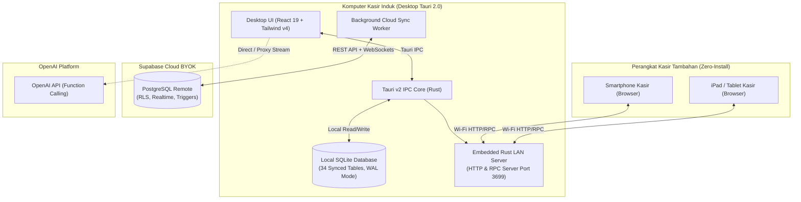

# 🚀 Kivo — Modern Multi-Branch POS & ERP Platform (v1.4.0)

<div align="center">


**Next-Generation Offline-First Point of Sale & Enterprise Resource Planning**  
*Engineered with Rust, Tauri 2.0, React 19, SQLite, and Supabase Cloud Sync.*

[](https://github.com/AchiraStudio/kivo/releases)
[](https://www.rust-lang.org/)
[](https://tauri.app/)
[](https://react.dev/)
[](https://www.typescriptlang.org/)
[](https://tailwindcss.com/)
[](https://www.sqlite.org/)
[](https://supabase.com/)
[](LICENSE)

[Fitur Utama](#-fitur-utama) •
[Inovasi v1.4.0](#-apa-yang-baru-di-versi-140) •
[Arsitektur Sistem](#-arsitektur-sistem) •
[Instalasi & Menjalankan](#-instalasi--menjalankan) •
[Konfigurasi BYOK](#-arsitektur-keamanan-byok) •
[Hardware & POS](#-dukungan-hardware--printer) •
[Struktur Kode](#-struktur-folder-proyek)

</div>

---

## 📖 Tentang Kivo

**Kivo** adalah platform manajemen bisnis, Point of Sale (POS), dan Enterprise Resource Planning (ERP) modern dengan arsitektur **Offline-First**, dirancang khusus untuk bisnis ritel, apotek, klinik, grosir, minimarket, dan F&B multi-cabang.

Berbeda dengan sistem POS konvensional yang bergantung penuh pada koneksi internet, Kivo memproses seluruh transaksi langsung di atas **database SQLite lokal berkecepatan tinggi** dengan engine backend native **Rust (Tauri 2.0)**. Seluruh transaksi kasir, pencarian ribuan SKU obat/barang, dan pencetakan struk thermal berjalan seketika dengan latensi 0ms.

Ketika internet aktif, sistem secara otomatis melakukan sinkronisasi dua arah (*bidirectional sync*) ke **Supabase Cloud** untuk mengonsolidasikan laporan penjualan, pergerakan stok antar-cabang, dan jurnal akuntansi secara terpusat.

Di **Kivo v1.4.0**, Anda bahkan **tidak perlu menginstal aplikasi di setiap kasir**: cukup nyalakan fitur **Host QR Terminal**, dan staf Anda dapat langsung membuka kasir dari smartphone (iPhone/Android) atau tablet/iPad secara instan melalui Wi-Fi lokal.

---

## ✨ Apa yang Baru di Versi 1.4.0?

Kivo v1.4.0 menghadirkan lompatan besar dalam mobilitas, kecepatan pelayanan, dan fleksibilitas perangkat:

```
┌────────────────────────────────────────────────────────────────────────┐
│                        HIGHLIGHT RILIS KIVO v1.4.0                     │
├────────────────────────────────────────────────────────────────────────┤
│ 📱 Web Terminal QR     · Buka kasir di HP & iPad via Wi-Fi tanpa instal│
│ 🎨 Mobile/Tablet UI    · Overhaul ergonomis, tidak makan tempat layar  │
│ 💊 Standout Item Cards · Avatar visual kategori & indikator stok jelas │
│ ⚡ Live Cart Feedback  · Highlight border aktif & badge jumlah di kartu │
│ 🔄 Multi-Device Sync   · Transaksi di HP langsung update stok di PC    │
│ 🌐 Showcase Web Demo   · Simulator interaktif Kivo di web (/demo)      │
│ 🧹 Authoritative Cloud · Pembersihan otomatis workspace yang dihapus   │
└────────────────────────────────────────────────────────────────────────┘
```

1. **Terminal Kasir Web Zero-Install (LAN Host Engine):**
   - Komputer kasir utama bertindak sebagai host server lokal menggunakan server HTTP/RPC tersemat di Rust (port default `3699`).
   - Cukup klik tombol **Host QR v1.4** di topbar, lalu pindai kode QR dengan kamera smartphone atau tablet untuk langsung membuka tampilan kasir POS di browser.
   - Perangkat web langsung mewarisi sesi workspace kasir induk tanpa perlu melewati onboarding wizard.

2. **Overhaul UI/UX Mobile & Tablet ("Space-Efficient"):**
   - **Bottom Navigation Bar**: Navigasi bawah ringkas ramah ibu jari (*Kasir*, *Ringkasan*, *Produk*, *Laporan*, *Menu*).
   - **Sidebar Desktop Otomatis Sembunyi**: Di layar `< 768px`, sidebar desktop otomatis disembunyikan untuk memberikan 100% lebar layar bagi kasir.
   - **Tab Switcher Simetris**: Tab *Katalog Produk* dan *Keranjang* menggunakan CSS Grid 50/50 yang seimbang tanpa teks terpotong atau wrap berantakan.
   - **Floating Cart Capsule**: Bar belanjaan mengapung interaktif di bagian bawah katalog dengan total rupiah real-time dan tombol 1-tap bayar.

3. **Kartu Produk Lebih Standout & Tactile:**
   - **Avatar Visual Bertema Kategori**: Ikon dinamis untuk Medis/ALKES (biru), Obat/Kapsul (ungu), Perawatan/Baby (rose), Herbal (hijau), dan Ritel Umum (violet).
   - **Status Stok dengan Color-Coded Dot**: Titik hijau (`● 24`) untuk stok aman, titik kuning berdenyut (`● Sisa 2`) untuk stok menipis, dan titik merah (`● Habis`) untuk stok kosong.
   - **In-Cart Micro-Interactions**: Begitu produk diklik, kartu langsung menyala dengan highlight border ungu, floating badge `✓ {qty}`, dan tombol tambah yang aktif.

4. **Pembersihan Workspace Hantu (Authoritative Cloud Check):**
   - Supabase Cloud kini menjadi penentu mutlak ketersediaan workspace saat online. Jika suatu cabang/workspace telah dihapus di cloud, sistem otomatis membersihkannya dari database lokal, meng-unassign user, dan membersihkan dropdown.

---

## ⚡ Fitur Utama Ekosistem Kivo

### 1. 🛒 Kivo POS (Point of Sale & Kasir Kilat)
* **Pencarian Kilat & Scanner Barcode:** Pencarian instan ribuan SKU, dukungan barcode hardware (USB/Bluetooth), dan navigasi kategori sekali klik.
* **Manajemen Sesi Kasir (Cash Shifts):** Kas modal awal saat buka shift, pencatatan kas masuk/keluar, dan rekonsiliasi kas laci fisik saat tutup shift.
* **Split Payment & Multi-Payment:** Dukungan pembayaran terpisah dalam satu transaksi: Tunai, QRIS Dinamis/Statis, Transfer Bank, Kartu Debit/Kredit, dan Piutang Pelanggan (*Credit Limit*).
* **Mesin Promosi Otomatis:**
  - BOGO (*Buy One Get One*)
  - Diskon Persentase & Potongan Nominal
  - Harga Grosir Bertingkat (*Tiered Quantity Pricing*)
  - Promo Bundling Paket
  - Diskon Khusus Member & VIP
* **Retur Penjualan (Sales Return):** Pembatalan atau retur faktur dengan pengembalian stok otomatis ke kartu stok gudang.
* **Kustomisasi Total & Negosiasi Harga:** Fitur ubah total bayar manual untuk transaksi tawar-menawar grosir dengan pencatatan selisih otomatis.

### 2. 📦 Kivo Inventory & Katalog Produk
* **Hierarki Multi-Satuan:** Mendukung konversi satuan bertingkat (contoh: *Karton ➔ Box ➔ Strip ➔ Tablet*) dengan pengali dan harga jual independen per satuan.
* **Manajemen Batch & Tanggal Kadaluarsa (Expiry Date):** Pelacakan nomor batch masuk, pengingat kadaluarsa dini (*early expiry alert*), dan badge khusus obat resep dokter (**`Rx`**).
* **Stock Opname Digital:** Hitung fisik barang secara berkala dengan rekap selisih (*variance*) dan pembuatan jurnal penyesuaian otomatis.
* **Kartu Stok Mendalam (Stock Ledger):** Rekam jejak seluruh mutasi barang: Penjualan, Pembelian, Retur, dan Penyesuaian Manual.

### 3. 📥 Kivo Purchasing & Pengadaan Barang
* **Surat Pesanan / Purchase Order (PO):** Pembuatan PO resmi ke supplier dengan estimasi biaya dan tanggal perkiraan kirim.
* **Penerimaan Barang (Goods Receipt):** Verifikasi barang datang terhadap PO atau penerimaan langsung (*Direct Receive*).
* **Perhitungan HPP / COGS Otomatis:** Nilai HPP rata-rata diperbarui secara real-time setiap kali ada barang baru yang masuk gudang.
* **Manajemen Hutang Usaha (Accounts Payable):** Pelacakan jatuh tempo faktur supplier dan pencatatan riwayat cicilan hutang.

### 4. 📑 Kivo Double-Entry Accounting (Akuntansi Terintegrasi)
* **Jurnal Otomatis:** Setiap transaksi kasir, pembelian supplier, retur barang, dan mutasi kas otomatis membentuk jurnal debit/kredit tanpa perlu input akuntan manual.
* **Bagan Akun (Chart of Accounts - COA):** Standar hierarki akuntansi (Aset Lancar, Kas & Bank, Piutang, Persediaan, Kewajiban, Ekuitas, Pendapatan, HPP, Beban Operasional).
* **Laporan Keuangan Standar:**
  - Laporan Laba Rugi (*Profit & Loss Statement*)
  - Laporan Neraca (*Balance Sheet*)
  - Neraca Saldo (*Trial Balance*)
* **Pilihan Valuasi Persediaan:** Pilihan fleksibel antara **Average (Rata-rata)**, **FIFO**, atau **LIFO**.

### 5. 🤖 Kivo AI Assistant (Didukung oleh Achira AI)
* **Asisten Bisnis Interaktif:** Akses cepat melalui tombol di Topbar atau shortcut keyboard.
* **Function Calling Cerdas:** Mengambil data real-time dari SQLite untuk menjawab pertanyaan bisnis Anda:
  - *"Berapa omset toko hari ini dan metode bayar apa yang paling dominan?"*
  - *"Sebutkan 5 produk dengan stok menipis yang harus segera di-order!"*
  - *"Berapa perkiraan laba kotor toko minggu ini?"*
  - *"Cek apakah ada obat/barang yang kadaluarsa bulan depan."*
* **Model Fleksibel:** Kompatibel dengan semua model OpenAI (`gpt-4o-mini`, `gpt-4o`, `o3-mini`, dll.) menggunakan API Key Anda sendiri.

### 6. ☁️ Kivo Cloud & Multi-Branch Sync
* **Sinkronisasi 34 Tabel Supabase:** Seluruh data master, transaksi, promo, dan jurnal tersinkronisasi mulus antar cabang.
* **Pencegahan Sync-Loop:** Menggunakan flag `updated_by` untuk mencegah loop data bolak-balik antara kasir dan cloud.
* **Multi-Tenant Workspace:** Buat workspace baru atau hubungkan cabang lain cukup dengan membagikan **Kode Undangan (Invite Code)**.
* **Fitur Nuke Data Cloud:** Tombol khusus di pengaturan untuk mengosongkan transaksi & katalog uji coba di cloud dengan **jaminan 100% akun user dan workspace tetap aman**.

---

## 🏛️ Arsitektur Sistem

Kivo menggabungkan keandalan sistem native desktop dengan fleksibilitas antarmuka web modern:



---

## 🛡️ Arsitektur Keamanan BYOK (Bring Your Own Key)

Kivo menerapkan model keamanan zero-trust:
1. **Tanpa Kredensial Bawaan:** Tidak ada token API, URL Supabase, atau fallback secret yang ditanam di dalam kode sumber maupun file binary.
2. **Bebas Compile-Time Leaks:** Makro `option_env!` telah dihapus seluruhnya dari backend Rust untuk mencegah kebocoran env mesin build.
3. **Penyimpanan Terisolasi:** Kredensial Supabase dan OpenAI disimpan secara lokal di tabel SQLite `global_settings` dan browser encrypted storage.
4. **Pembersihan Cloud Aman (Safe Cloud Nuke):** Fasilitas penghapusan data uji coba cloud yang secara mutlak mengecualikan tabel identitas (`users`, `workspaces`, `user_roles`).

---

## 💻 Instalasi & Menjalankan

### Persyaratan Sistem
* **Sistem Operasi:** Windows 10/11 (64-bit), macOS 11+, atau Linux
* **Node.js:** v18.0.0 atau lebih baru (direkomendasikan v20+)
* **Rust:** v1.75.0 atau lebih baru (`rustup toolchain install stable`)
* **Build Tools Windows:** C++ Build Tools (via Visual Studio Installer)

### Langkah Menjalankan Aplikasi

1. **Clone Repositori:**
   ```bash
   git clone https://github.com/AchiraStudio/kivo.git
   cd kivo
   ```

2. **Instal Dependensi Frontend:**
   ```bash
   npm install
   ```

3. **Jalankan Aplikasi Desktop (Development Mode):**
   ```bash
   npm run tauri dev
   ```

4. **Jalankan Web Showcase Demo:**
   ```bash
   cd demo
   npm install
   npm run dev
   ```

5. **Build Binary Installer Windows (.exe / .msi):**
   ```bash
   npm run tauri build
   ```
   *File installer akan tersedia di direktori `src-tauri/target/release/bundle/`.*

---

## 🚀 Panduan Pengaturan Pertama Kali (Setup Wizard)

Saat pertama kali membuka aplikasi di komputer baru, Kivo akan menampilkan **Onboarding Setup Wizard**:

1. **Pilih Mode:**
   * **Buat Toko Baru:** Untuk memulai database toko baru dari nol (offline).
   * **Gabung Workspace:** Masukkan kode undangan dari cabang utama untuk langsung sinkronisasi data katalog.
2. **Profil Toko:** Masukkan nama toko, nama cabang, nomor telepon, alamat, dan logo struk.
3. **Integrasi Supabase Cloud (BYOK - Opsional):**
   * Buat project gratis di [supabase.com](https://supabase.com).
   * Buka menu **SQL Editor** di Supabase, lalu jalankan file [`supabase_full_bootstrap.sql`](supabase_full_bootstrap.sql).
   * Salin **Project URL** dan **Anon Key** ke dalam setup wizard.
4. **Kivo AI Assistant (BYOK - Opsional):**
   * Masukkan API Key OpenAI Anda (`sk-...`) dari [platform.openai.com/api-keys](https://platform.openai.com/api-keys).
5. **Buat Akun Pemilik (Master Owner):** Tentukan username dan password untuk akun administrator tertinggi.

---

## 🖨️ Dukungan Hardware & Printer POS

Kivo mendukung berbagai macam printer thermal POS kasir melalui protokol **ESC/POS** standar dan driver **HPRT Windows SDK**:

* **Koneksi yang Didukung:** USB, Network (LAN / Ethernet TCP/IP), dan Bluetooth Thermal Printers.
* **Ukuran Kertas:** 58mm dan 80mm.
* **Fitur Struk Pintar:**
  - Cetak logo toko monokrom di header struk.
  - Cetak otomatis saat pembayaran sukses (*Auto-Print*).
  - Pembuka laci uang otomatis (*Auto Cash Drawer Kick* via pin RJ11).
  - Pemotong kertas otomatis (*Auto Paper Cut*).
* **Konfigurasi:** Buka menu **Pengaturan** ➔ tab **Printer & Hardware POS**.

---

## ⌨️ Shortcut Keyboard Kasir (POS Desktop)

| Tombol | Fungsi |
| :--- | :--- |
| `F1` | Buka Pencarian Cepat Produk / Barcode |
| `F2` | Buka Laci Kasir (Cash Drawer Kick) |
| `F3` | Pilih Pelanggan / Cek Poin Member |
| `F4` | Tahan Transaksi Sementara (Hold Bill) |
| `F7` | Lihat Riwayat & Cetak Ulang Nota |
| `F8` / `Alt+T` | Kustomisasi / Tawar Total Harga Manual |
| `Alt+H` | Edit Harga Baris Barang yang Dipilih |
| `Alt+S` | Edit Subtotal Baris Barang yang Dipilih |
| `End` / `Space` | Langsung ke Layar Pembayaran & Checkout |
| `Esc` | Tutup Modal / Dialog yang Aktif |

---

## 🗂️ Struktur Folder Proyek

```
kivo/
├── src/                          # Frontend Kasir Utama (React 19 + Vite + Tailwind v4)
│   ├── components/               # Komponen UI Reusable
│   │   ├── ai/                   # Modal & Widget Kivo AI Chat
│   │   ├── common/               # HostQrModal, KivoLogo, ConfirmModal
│   │   ├── layout/               # Sidebar, Topbar, MobileNav, MobileMenuDrawer
│   │   └── ui/                   # Modal, Drawer, TabBar, Select, Toast
│   ├── pages/                    # Halaman Modul Bisnis Utama
│   │   ├── accounting/           # Akuntansi, Jurnal, Laba Rugi, Neraca
│   │   ├── inventory/            # Stok, Katalog, Multi-Satuan, Opname
│   │   ├── onboarding/           # Setup Wizard pertama kali
│   │   ├── pos/                  # Kasir POS, Pembayaran, Struk, Retur
│   │   ├── purchasing/           # Pesanan Pembelian (PO), Penerimaan
│   │   ├── reports/              # Laporan Penjualan, Laba, Mutasi
│   │   └── settings/             # Pengaturan Umum, Cloud, Hardware, User
│   ├── hooks/                    # useRealtimeSync, useBarcodeScanner
│   ├── lib/                      # API Client, Supabase, Permissions, ESC/POS
│   └── store/                    # State Management (Zustand)
├── demo/                         # Showcase Website Kivo v1.4.0 (/demo)
│   ├── src/components/hero/      # InteractiveAppWindow (Simulator POS Desktop)
│   └── src/styles/               # demo.css (Mobile Responsive Overhaul)
├── src-tauri/                    # Backend Desktop Application (Rust + Tauri v2)
│   ├── src/
│   │   ├── commands/             # Handler perintah Tauri (POS, Sync, AI, LAN)
│   │   ├── db/                   # Koneksi SQLite & 60 File Migrasi SQL
│   │   └── main.rs               # Entry point aplikasi desktop
│   ├── Cargo.toml                # Dependensi Rust
│   └── tauri.conf.json           # Konfigurasi Window, Bundle, dan Versi
├── hprt-sdk/                     # SDK & DLL Vendor Printer HPRT
├── supabase_full_bootstrap.sql   # Skrip DDL lengkap untuk Supabase Cloud
└── supabase_full_schema.sql      # Skrip skema referensi
```

---

## 📄 Lisensi

Proyek ini dilisensikan di bawah lisensi **MIT License** — silakan gunakan, pelajari, dan kembangkan untuk kebutuhan bisnis Anda.

<div align="center">
  <sub>Dibangun dengan dedikasi oleh <strong>Achira Studio</strong> untuk kemajuan UMKM & bisnis ritel modern di Indonesia.</sub>
</div>
